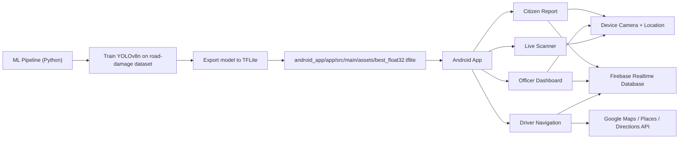
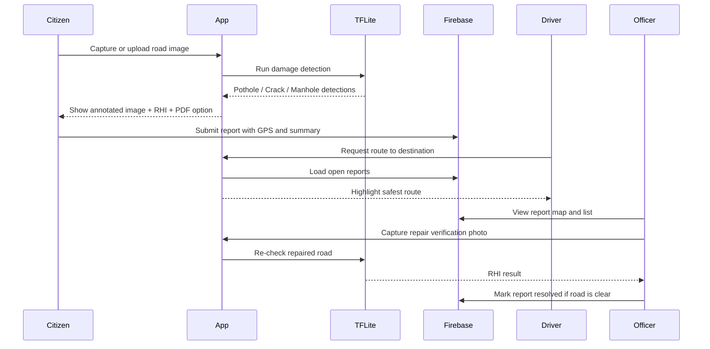

# RoadFlow-AI

RoadFlow-AI is an Android-first road monitoring project that combines on-device computer vision, citizen reporting, smart route guidance, and officer-side verification.

At a high level, the project does four things:

1. Detects potholes, cracks, and manholes with a YOLOv8 model exported to TensorFlow Lite.
2. Lets citizens capture road images, compute a Road Health Index (RHI), and submit geo-tagged reports.
3. Helps drivers choose safer routes by scoring Google Directions alternatives against open damage reports.
4. Gives public works officers a live map of open reports and a camera-based repair verification flow.

## Visualization





## What is in this repo

```text
RoadFlow-AI/
|-- android_app/      # Android client in Kotlin
|-- ml_pipeline/      # Dataset prep, training, export, and RHI utilities
|-- FIREBASE_SETUP.md # Firebase-specific setup notes
```

## Core product flows

### 1. Live road scanning
- `LiveScannerActivity` uses CameraX and `RoadDamageAnalyzer` for real-time inference.
- `TFLiteHelper` loads `best_float32.tflite` from app assets and runs YOLOv8-style post-processing plus non-max suppression.
- The app computes a simple Road Health Index:
  - `RHI = max(0, 100 - 15*potholes - 5*cracks)`

### 2. Citizen reporting
- `CitizenReportActivity` lets a user take a photo or pick one from the gallery.
- The image is analyzed locally on-device.
- The user sees an annotated image, damage summary, RHI score, and a generated PDF report.
- Submitting pushes a structured report into Firebase Realtime Database under `reports/`.

### 3. Safer driver navigation
- `DriverNavigationActivity` uses Google Places Autocomplete and the Google Directions API.
- Alternative routes are scored against open road-damage reports stored in Firebase.
- `RouteScorer` checks whether reports intersect a route polyline using a 25 m tolerance.
- The app highlights the safest route and can switch into active navigation mode with proximity alerts.

### 4. Officer dashboard and repair verification
- `OfficerDashboardActivity` loads open reports from Firebase onto a Google Map and a bottom-sheet list.
- Officers can capture a fresh image after a repair.
- If the verification scan returns `RHI = 100`, the report status is updated from `open` to `resolved`.

## Tech stack

### Android app
- Kotlin + Android Views/ViewBinding
- CameraX
- TensorFlow Lite
- Google Maps SDK
- Google Places SDK
- Google Directions API over OkHttp
- Firebase Realtime Database

### ML pipeline
- Python
- Ultralytics YOLOv8
- TensorFlow / ONNX export chain
- Kaggle API for dataset download

## ML pipeline

The Python side is organized as a simple training-to-deployment pipeline:

1. `download_data.py`
   - Downloads the Kaggle dataset `lorenzoarcioni/road-damage-dataset-potholes-cracks-and-manholes`
   - Builds a YOLOv8 dataset layout
   - Splits the data into `train` 80%, `valid` 10%, `test` 10%
2. `train.py`
   - Trains `yolov8n.pt`
   - Default settings: `50` epochs, `640` image size, batch size `16`
3. `export.py`
   - Exports the trained model to TensorFlow Lite for Android deployment
4. `rhi_calculator.py`
   - Contains reusable Python-side RHI logic and a small self-test/demo

Detected classes in the current dataset:

- Pothole
- Crack
- Manhole

Important generated artifacts:

- `ml_pipeline/runs/detect/train/weights/best.pt`
- `ml_pipeline/runs/detect/train/weights/best.onnx`
- `android_app/app/src/main/assets/best_float32.tflite`

## Android app structure

Important Kotlin files:

- `MainActivity` - launcher and role selection
- `LoginActivity` - placeholder entry into driver/officer flows
- `LiveScannerActivity` - real-time road scanning
- `CitizenReportActivity` - report creation, Firebase submission, PDF export
- `DriverNavigationActivity` - smart routing and active navigation alerts
- `OfficerDashboardActivity` - report map, list, and repair verification
- `TFLiteHelper` - model loading, inference, and post-processing
- `RouteScorer` - route-vs-hazard scoring
- `PdfGeneratorHelper` - PDF report generation

## Setup

### Prerequisites

- Android Studio
- Android SDK 34
- A Google Maps Platform API key
- A Firebase project with Realtime Database enabled
- Python 3.10+ recommended for the ML pipeline

### Android setup

1. Open `android_app` in Android Studio.
2. Add `google-services.json` to:
   - `android_app/app/google-services.json`
3. Put your Maps key in:

```properties
# android_app/local.properties
MAPS_API_KEY=YOUR_GOOGLE_MAPS_API_KEY
```

4. Sync Gradle and build the app.

### Firebase notes

- The app expects Firebase Realtime Database reports under the `reports` node.
- The configured database URL lives in `AppConstants.kt`.
- `FIREBASE_SETUP.md` contains the project-specific Firebase bootstrapping steps.

### ML setup

1. Create and activate a Python environment inside `ml_pipeline`.
2. Install dependencies:

```bash
pip install -r requirements.txt
```

3. Add Kaggle credentials:
   - `ml_pipeline/kaggle.json`
4. Run the pipeline:

```bash
python download_data.py
python train.py
python export.py
```

5. Copy the exported `.tflite` model into:
   - `android_app/app/src/main/assets/`

## How the scoring works

### Road Health Index

- Start from `100`
- `-15` for each pothole
- `-5` for each crack
- Clamp at `0`

Grades used in the project:

- `75-100`: Good
- `50-74`: Fair
- `25-49`: Poor
- `0-24`: Critical

### Route safety

- Fetch alternative routes from Google Directions
- Decode route polylines
- Compare each route against open Firebase reports
- Rank routes by the fewest hazard intersections

## Current implementation notes

- The login flow is currently a placeholder screen, not a full authentication system.
- Citizen reporting uses Firebase Realtime Database; Firebase Storage is included as a dependency but is not yet central to the current flow.
- PDF generation currently uses approximate GPS text inside the PDF template.
- Some generated folders and local environment files are checked into the repo, so this project is best treated as a working prototype rather than a cleaned production repo.

## Demo journey

1. Train and export the model in `ml_pipeline`.
2. Place the exported TFLite file in the Android app assets.
3. Launch the app and choose one of three paths:
   - Live Scanner
   - Report a Damage
   - Login, then continue as Driver or Officer
4. Submit citizen reports to Firebase.
5. Use those reports to power driver route scoring and officer verification.

## License

No license file is currently included in this repository.
