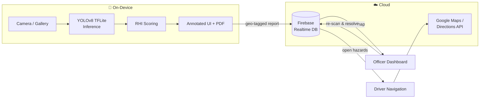
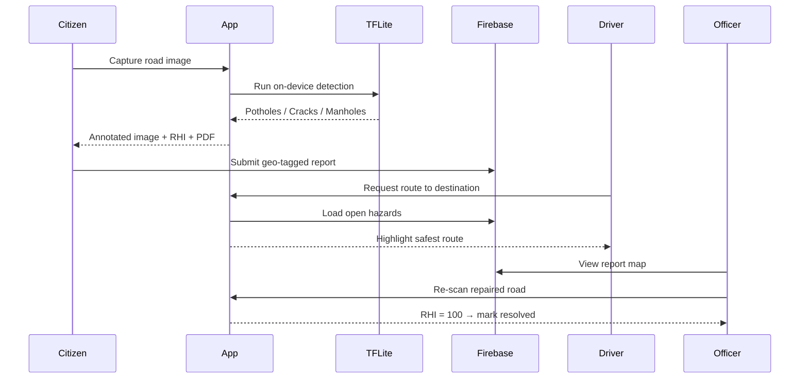

<div align="center">

# 🛣️ RoadFlow-AI

### On-device AI for safer roads — detect damage, score road health, and route around hazards.

*An Android app that runs a YOLOv8 computer-vision model entirely on the phone to spot potholes, cracks, and manholes in real time, turns each scan into a Road Health Index, and uses crowd-sourced reports to guide drivers along safer routes.*

<br/>


**Team A5P** &nbsp;•&nbsp; **[🎥 Demo Video](https://drive.google.com/file/d/1t5ex3MMGW-FbuBdW06XQUrHlS0i5rlqK/view?usp=sharing)** &nbsp;•&nbsp; **[🖼️ Screenshots](https://drive.google.com/drive/folders/1xjkSZiIAAusMXqz5sP1-8s1l74J6vclO?usp=sharing)**

</div>

---

## 📑 Table of Contents

- [Overview](#-overview)
- [Problem Statement](#-problem-statement)
- [Solution](#-solution)
- [Features](#-features)
- [How the AI Works](#-how-the-ai-works)
- [Technology Stack](#️-technology-stack)
- [Architecture & Workflow](#️-architecture--workflow)
- [Screenshots & Demo](#️-screenshots--demo)
- [Installation & Setup](#-installation--setup)
- [Usage Guide](#-usage-guide)
- [Project Structure](#-project-structure)
- [Limitations](#-limitations)
- [Roadmap](#️-roadmap)
- [Team](#-team)

---

## 🌟 Overview

**RoadFlow-AI** is an Android-first road-monitoring platform that combines **on-device computer vision**, **citizen reporting**, **smart route guidance**, and **officer-side verification** into one app. It detects road damage in real time using a YOLOv8 model exported to TensorFlow Lite, quantifies it as an objective **Road Health Index (RHI)**, and feeds those geo-tagged reports into safer driver navigation and a public-works repair-verification workflow — all with the ML running **offline on the phone**.

---

## ❗ Problem Statement

Poor road conditions — potholes, cracks, and unsafe manholes — cause **accidents, injuries, vehicle damage, and costly repairs** every year. Yet the systems meant to fix them are slow and disconnected:

- **Reporting is manual and subjective** — citizens have no easy, objective way to report damage, and "how bad is this road?" is a matter of opinion.
- **Authorities lack real-time data** — public-works departments can't see, prioritize, or verify road issues at scale.
- **Drivers are unaware** — navigation apps optimize for time, not road safety, routing drivers straight over known hazards.

There is no single, accessible tool that **detects**, **quantifies**, **reports**, and **acts on** road damage in real time.

---

## 💡 Solution

RoadFlow-AI closes that loop on a single device:

1. **Detect** — a citizen points their phone at the road; an on-device neural network identifies potholes, cracks, and manholes frame-by-frame.
2. **Quantify** — detections are converted into an objective **Road Health Index** (0–100), removing the guesswork.
3. **Report** — the user submits a geo-tagged, RHI-scored report (with an auto-generated PDF) to a shared cloud database.
4. **Act** — those reports power **safer driver routing** (avoiding hazard-heavy roads) and an **officer dashboard** that verifies repairs by re-scanning until the RHI returns to 100.

No server-side inference, no round trips — the model runs **offline, on the phone**, in milliseconds per frame.

---

## ✨ Features

| | Feature | What it does |
|---|---|---|
| 📷 | **Live Road Scanner** | Real-time CameraX feed analyzed frame-by-frame by a TFLite YOLOv8 model with on-screen bounding boxes and a live RHI badge. |
| 📝 | **Citizen Reporting** | Snap or upload a photo → get an annotated image, damage breakdown, RHI score, and a generated **PDF report** → submit a geo-tagged entry to the cloud. |
| 🧭 | **Safer Driver Navigation** | Scores Google Directions alternatives against live hazard reports and highlights the route that crosses the **fewest** known road defects. |
| 🛠️ | **Officer Dashboard** | A live map + list of open reports; officers re-scan a repaired road and the report auto-resolves when the RHI returns to 100. |
| 📄 | **PDF Reports** | Every scan can be exported as a shareable PDF with the annotated image, damage summary, and RHI grade. |

---

## 🧠 How the AI Works

RoadFlow-AI pairs a lightweight detector with a transparent scoring rule:

```
            ┌──────────────┐     detects      ┌──────────────────────────┐
 Camera ──▶ │  YOLOv8n      │ ───────────────▶ │ Pothole · Crack · Manhole │
 frame      │  (TFLite)     │  bounding boxes  └──────────────────────────┘
            └──────────────┘                              │
                                                          ▼
                                       RHI = max(0, 100 − 15·potholes − 5·cracks)
```

**The model**
- **Architecture:** YOLOv8 **Nano** — chosen for sub-100 ms inference on mid-range phones.
- **Training data:** Kaggle *Road Damage Dataset (Potholes, Cracks & Manholes)*, split 80 / 10 / 10.
- **Export chain:** trained on GPU → `.pt → ONNX → TensorFlow → TFLite`.
- **On-device tensor:** input `(1, 640, 640, 3)` float32 · output `(1, 7, 8400)` → custom Kotlin post-processing with confidence thresholding + **Non-Max Suppression**.
- **Shipped artifact:** [`best_float32.tflite`](android_app/app/src/main/assets/best_float32.tflite) (~12 MB), bundled in the app — no download required.

**The Road Health Index**

| Score | Grade |
|---|---|
| 75–100 | 🟢 Good |
| 50–74 | 🟡 Fair |
| 25–49 | 🟠 Poor |
| 0–24 | 🔴 Critical |

---

## 🛠️ Technology Stack

| Layer | Technologies |
|---|---|
| **Mobile** | Kotlin · Android Views + ViewBinding · CameraX · Material Components |
| **On-device ML** | TensorFlow Lite · YOLOv8 (Ultralytics) · custom NMS post-processing |
| **Cloud & APIs** | Firebase Realtime Database · Google Maps SDK · Places SDK · Directions API (OkHttp) |
| **Build & tooling** | Gradle (dependency management) · Android `PdfDocument` for reports |

> **Dependencies** are declared in [`android_app/app/build.gradle`](android_app/app/build.gradle) and resolved automatically by Gradle on first build — there is no manual install step.

---

## 🏗️ Architecture & Workflow





---

## 🖼️ Screenshots & Demo

| Resource | Link |
|---|---|
| 🎥 **Demo / screen-record video** | [Watch on Google Drive](https://drive.google.com/file/d/1t5ex3MMGW-FbuBdW06XQUrHlS0i5rlqK/view?usp=sharing) |
| 🖼️ **Screenshots folder** | [View on Google Drive](https://drive.google.com/drive/folders/1xjkSZiIAAusMXqz5sP1-8s1l74J6vclO?usp=sharing) |

---

## 🚀 Installation & Setup

### Prerequisites
- **Android Studio** (latest) with **Android SDK 34**
- A **[Google Maps Platform](https://developers.google.com/maps)** API key (Maps SDK for Android, Directions API, Places API enabled)
- A **Firebase** project with **Realtime Database** enabled — see [FIREBASE_SETUP.md](FIREBASE_SETUP.md)

### Steps

1. **Clone the repository**
   ```bash
   git clone https://github.com/sarukeshray/RoadFlow-ai-include-io--submission.git
   cd RoadFlow-ai-include-io--submission
   ```

2. **Configure your secrets** — copy the template and fill in your own keys:
   ```bash
   cp android_app/.env.example android_app/.env
   ```
   Open `android_app/.env` and set your Google Maps + Firebase values. This file is
   **gitignored** and is injected into `BuildConfig` at build time — it drives both the
   Maps key and Firebase initialization, so **no `google-services.json` is required**.
   (Full Firebase walkthrough in [FIREBASE_SETUP.md](FIREBASE_SETUP.md).)

3. **Open & build** — open the **`android_app`** folder in Android Studio, let Gradle
   sync (dependencies download automatically), then press ▶ **Run** on a device or emulator.

> 🧰 **Build note:** Android Studio uses its own bundled JDK (17/21), so it "just works."
> If you build from the command line, use a JDK **≤ 23** (the bundled Gradle 8.11.1 does
> not yet support JDK 24/25). Example:
> ```bash
> cd android_app && ./gradlew assembleDebug
> ```

---

## 📖 Usage Guide

Once the app is installed and running:

1. **Launch the app** → the home screen offers three paths: **Live Scanner**, **Report a Damage**, and **Login** (Driver / Officer).

2. **Live Scanner** 📷
   - Point the camera at a road. Detections (potholes / cracks / manholes) are boxed in real time with a live **RHI** score.

3. **Report a Damage (Citizen)** 📝
   - Take a photo or pick one from the gallery.
   - View the annotated image, damage summary, and RHI grade.
   - Tap **Download PDF Report** to save a shareable report, and **Submit Report** to push a geo-tagged entry to Firebase.

4. **Driver Navigation** 🧭
   - Log in → continue as **Driver** → search a destination.
   - The app fetches route alternatives and highlights the **safest** one (fewest hazards), with proximity alerts in active navigation.

5. **Officer Dashboard** 🛠️
   - Log in → continue as **Officer** → see all open reports on a map + list.
   - After a repair, re-scan the road; when **RHI returns to 100**, the report is marked **resolved**.

---

## 📂 Project Structure

```text
RoadFlow-AI/
├── android_app/                              # Kotlin Android client (Gradle project root)
│   ├── .env.example                          # Secrets template (copy to .env)
│   └── app/
│       ├── build.gradle                      # App dependencies + BuildConfig injection
│       └── src/main/
│           ├── AndroidManifest.xml
│           ├── assets/best_float32.tflite     # Bundled YOLOv8 model
│           ├── java/com/roadflow/ai/
│           │   ├── MainActivity.kt            # Home / role selection
│           │   ├── RoadFlowApp.kt             # App entry — Firebase init from .env
│           │   ├── LiveScannerActivity.kt     # Real-time camera scanning
│           │   ├── CitizenReportActivity.kt   # Capture, score, PDF, submit
│           │   ├── DriverNavigationActivity.kt # Safe routing
│           │   ├── OfficerDashboardActivity.kt # Report map + repair verification
│           │   ├── TFLiteHelper.kt            # Model loading + inference + NMS
│           │   ├── RoadDamageAnalyzer.kt      # CameraX frame analyzer
│           │   ├── RouteScorer.kt             # Route-vs-hazard scoring
│           │   ├── PdfGeneratorHelper.kt      # PDF report generation
│           │   └── AppConstants.kt
│           └── res/                           # Layouts, drawables, values
├── FIREBASE_SETUP.md                         # Firebase + .env setup guide
└── README.md
```

---

## ⚠️ Limitations

- The model was trained on **paved (but damaged) roads**, so it may **struggle to detect damage on muddy / unpaved roads or in heavy-greenery areas** — the training dataset contained no such imagery. Training on a broader, more diverse dataset would overcome this.
- The **login flow is a role-selection placeholder**, not full authentication.
- **RHI is count-based** (per detection), not yet weighted by damage size/severity.

---

## 🗺️ Roadmap

- [ ] Full authentication (replace the placeholder login)
- [ ] Broaden training data to cover unpaved/muddy roads
- [ ] Severity-aware RHI (weight by damage size/area, not just count)
- [ ] Firebase Storage for original report imagery
- [ ] Cloud analytics dashboard for road-network health trends

---

## 👥 Team

**Team A5P**

| Role | Name | Email | Phone |
|---|---|---|---|
| **Team Lead** | Sarukesh | sarukeshray2912@gmail.com | 9751518210 |
| Member | Sivakumarane C | sivakumaranec@gmail.com | 9952121312 |
| Member | Pravin R | pravinrajasegar2007@gmail.com | 9944959686 |
| Member | Praveen Kumar B | praveenkumar392006@gmail.com | 7695923045 |

<div align="center">
<br/>
Built with ❤️ by Team A5P — from neural network to navigation.
</div>
