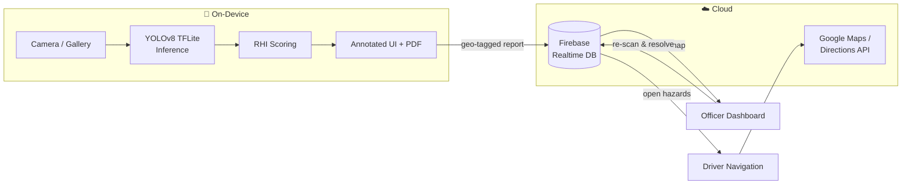
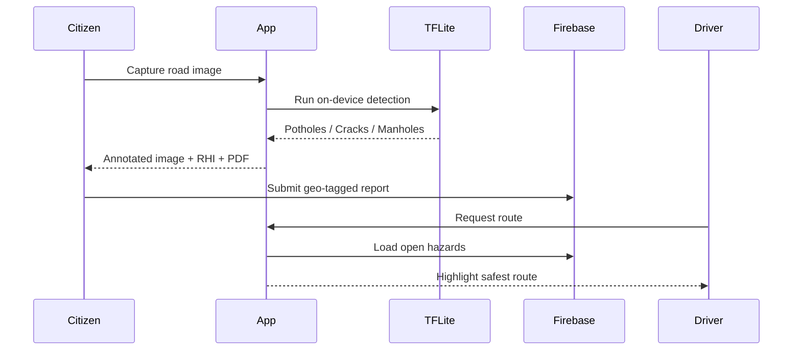

<div align="center">

# 🛣️ RoadFlow-AI

### On-device AI for safer roads — detect damage, score road health, and route around hazards.

*An Android app that runs a YOLOv8 computer-vision model entirely on the phone to spot potholes, cracks, and manholes in real time, turns each scan into a Road Health Index, and uses crowd-sourced reports to guide drivers along safer routes.*

<br/>


<br/>

**[📥 Download the APK](android_app/app/release/app-release.apk)** &nbsp;•&nbsp; **[✨ Features](#-features)** &nbsp;•&nbsp; **[🏗️ Architecture](#%EF%B8%8F-architecture)** &nbsp;•&nbsp; **[🚀 Getting Started](#-getting-started)**

</div>

---

## 💡 The Idea

Damaged roads cause accidents, vehicle wear, and millions in repair costs — yet reporting them is slow and manual. **RoadFlow-AI closes that loop on a single device:** a citizen points their phone at the road, an on-device neural network identifies the damage in real time, the app computes an objective **Road Health Index (RHI)**, and the geo-tagged report instantly powers safer routing for drivers and a verification workflow for public-works officers.

No server-side inference. No round trips. The model runs **offline, on the phone**, in milliseconds per frame.

---

## ✨ Features

| | Feature | What it does |
|---|---|---|
| 📷 | **Live Road Scanner** | Real-time CameraX feed analyzed frame-by-frame by a TFLite YOLOv8 model with on-screen bounding boxes and a live RHI badge. |
| 📝 | **Citizen Reporting** | Snap or upload a photo → get an annotated image, damage breakdown, RHI score, and a generated **PDF report** → submit a geo-tagged entry to the cloud. |
| 🧭 | **Safer Driver Navigation** | Scores Google Directions alternatives against live hazard reports and highlights the route that crosses the **fewest** known road defects. |
| 🛠️ | **Officer Dashboard** | A live map + list of open reports; officers re-scan a repaired road and the report auto-resolves when the RHI returns to 100. |

---

## 🧠 How the AI Works

RoadFlow-AI pairs a lightweight detector with a transparent scoring rule:

```
            ┌──────────────┐     detects      ┌─────────────────────────┐
 Camera ──▶ │  YOLOv8n      │ ───────────────▶ │ Pothole · Crack · Manhole│
 frame      │  (TFLite)     │   bounding boxes └─────────────────────────┘
            └──────────────┘                              │
                                                          ▼
                                       RHI = max(0, 100 − 15·potholes − 5·cracks)
```

**The model**
- **Architecture:** YOLOv8 **Nano** — chosen for sub-100 ms inference on mid-range phones.
- **Training data:** Kaggle *Road Damage Dataset (Potholes, Cracks & Manholes)*, split 80 / 10 / 10.
- **Pipeline:** trained on GPU → exported through the `.pt → ONNX → TensorFlow → TFLite` chain.
- **On-device tensor:** input `(1, 640, 640, 3)` float32 · output `(1, 7, 8400)` → custom Kotlin post-processing with confidence thresholding + **Non-Max Suppression**.
- **Shipped artifact:** [`best_float32.tflite`](android_app/app/src/main/assets/best_float32.tflite) (~12 MB), bundled in the app — no download required.

**The Road Health Index**

| Score | Grade |
|---|---|
| 75–100 | 🟢 Good |
| 50–74 | 🟡 Fair |
| 25–49 | 🟠 Poor |
| 0–24 | 🔴 Critical |

---

## 🏗️ Architecture





---

## 🛠️ Tech Stack

**Mobile** — Kotlin · Android Views + ViewBinding · CameraX · Material Components
**On-device ML** — TensorFlow Lite · YOLOv8 (Ultralytics) · custom NMS post-processing
**Cloud & APIs** — Firebase Realtime Database · Google Maps SDK · Places SDK · Directions API (OkHttp)
**Tooling** — Gradle · PDF generation (Android `PdfDocument`)

---

## 📂 Project Structure

```text
RoadFlow-AI/
├── android_app/                         # Kotlin Android client
│   └── app/src/main/
│       ├── java/com/roadflow/ai/
│       │   ├── LiveScannerActivity.kt   # Real-time camera scanning
│       │   ├── CitizenReportActivity.kt # Capture, score, PDF, submit
│       │   ├── DriverNavigationActivity.kt
│       │   ├── OfficerDashboardActivity.kt
│       │   ├── TFLiteHelper.kt          # Model loading + inference + NMS
│       │   ├── RouteScorer.kt           # Route-vs-hazard scoring
│       │   └── PdfGeneratorHelper.kt
│       └── assets/best_float32.tflite   # Bundled YOLOv8 model
├── FIREBASE_SETUP.md
└── README.md
```

---

## 🚀 Getting Started

### Prerequisites
- Android Studio (latest) + Android SDK 34
- A [Google Maps Platform](https://developers.google.com/maps) API key
- A Firebase project with Realtime Database enabled

### Run it
```bash
git clone <this-repo>
cd RoadFlow-AI/android_app
```

1. **Maps key** — add to `android_app/local.properties`:
   ```properties
   MAPS_API_KEY=YOUR_GOOGLE_MAPS_API_KEY
   ```
2. **Firebase** — drop your own `google-services.json` into `android_app/app/`
   *(not committed — provide your own; see [FIREBASE_SETUP.md](FIREBASE_SETUP.md))*.
3. **Build & run** — open `android_app` in Android Studio, sync Gradle, hit ▶.

> ⚡ Want to try it instantly? **[Download the prebuilt APK](android_app/app/release/app-release.apk)** and sideload it (enable "Install unknown apps").

---

## 🗺️ Roadmap

- [ ] Full authentication (the current login is a role-selection placeholder)
- [ ] Severity-aware RHI (weight by damage size/area, not just count)
- [ ] Firebase Storage for original report imagery
- [ ] Cloud analytics dashboard for road-network health trends

---

## 👤 Author

**Sarukesh Ray**
📧 sarukeshray2912@gmail.com

> Built as a full end-to-end showcase: dataset preparation, model training & TFLite export, custom on-device inference, and a multi-role Android product — from neural network to navigation.

<div align="center">
<br/>
⭐ If you find this project interesting, consider starring the repo!
</div>
